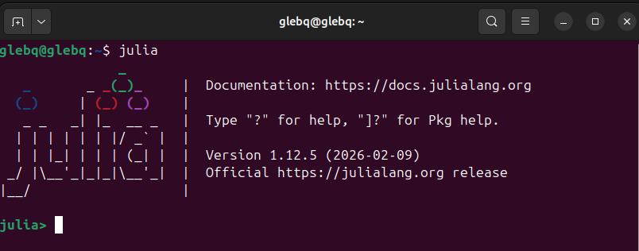

---
## Author
author:
  name: Беспутин Глеб Антонович
  email: glebb2005@mail.ru
  affiliation:
    - name: Российский университет дружбы народов
      country: Российская Федерация
      city: Москва
      address: ул. Миклухо-Маклая, д. 6

## Title
title: "Лабораторная работа №1"
subtitle: "Julia. Установка и настройка. Основные принципы"
license: "CC BY"
---

# Цель работы

Подготовить рабочее пространство и инструментарий для работы с языком программирования Julia, на простейших примерах познакомиться с основами синтаксиса Julia.

# Задание

1. Установить под свою операционную систему Julia, Jupyter.
2. Используя Jupyter Lab, повторить примеры из раздела 1.3.3.
3. Выполнить задания для самостоятельной работы из раздела 1.3.4.

# Теоретическое введение

## Язык программирования Julia

Julia — высокоуровневый динамический язык программирования, ориентированный на научные вычисления. Сочетает удобство динамической типизации с производительностью компилируемых языков. Ключевые особенности:

- **Множественная диспетчеризация** — выбор метода функции по типам всех аргументов.
- **JIT-компиляция** — код компилируется в машинные инструкции во время выполнения через LLVM.
- **Динамическая типизация** с возможностью явного указания типов.
- **Богатая система типов**: целые (`Int8`…`Int128`), беззнаковые (`UInt8`…`UInt128`), с плавающей точкой (`Float16`, `Float32`, `Float64`), комплексные (`Complex{T}`), логические (`Bool`).
- **Встроенная поддержка массивов**, матричных операций, параллелизма.

## Интерактивные блокноты Jupyter

Jupyter — среда для интерактивной работы, объединяющая текст, код и результаты в единый документ формата `.ipynb` (JSON). Основные элементы:

- **Ячейка** — отдельный фрагмент текста (Markdown) или кода (Code).
- **Ядро** — вычислительный бэкенд, в нашем случае `IJulia`.
- **Командный режим** (клавиша `Esc`) — навигация и операции над ячейками.
- **Режим редактирования** (`Enter`) — ввод содержимого.

Основные горячие клавиши: `Shift+Enter` — выполнить ячейку; `a`/`b` — вставить ячейку выше/ниже; `x` — удалить; `m`/`y` — режим текста/кода.

## Система типов Julia

Julia имеет развитую иерархию типов. Числовые типы образуют дерево:

- `Number` → `Real` → `Integer` → `Int8`, `Int16`, `Int32`, `Int64`, `Int128`, `UInt8`…`UInt128`
- `Number` → `Real` → `AbstractFloat` → `Float16`, `Float32`, `Float64`
- `Number` → `Complex{T}`

Диапазоны значений целых типов:

| Тип | Минимум | Максимум |
|-----|---------|----------|
| Int8 | −128 | 127 |
| Int16 | −32 768 | 32 767 |
| Int32 | −2 147 483 648 | 2 147 483 647 |
| Int64 | −9 223 372 036 854 775 808 | 9 223 372 036 854 775 807 |
| UInt8 | 0 | 255 |
| UInt16 | 0 | 65 535 |
| UInt32 | 0 | 4 294 967 295 |
| UInt64 | 0 | 18 446 744 073 709 551 615 |

## Функции ввода-вывода

Julia предоставляет несколько функций для работы с потоками и файлами:

| Функция | Назначение |
|---------|-----------|
| `print(x)` | Вывод без перевода строки |
| `println(x)` | Вывод с переводом строки |
| `show(x)` | Компактное представление значения |
| `write(io, x)` | Запись в поток |
| `read(io, T)` | Чтение из потока в тип `T` |
| `readline(io)` | Чтение одной строки |
| `readlines(io)` | Чтение всех строк в массив |
| `readdlm(path, delim)` | Чтение таблицы с разделителями |
| `parse(T, s)` | Преобразование строки в тип `T` |

# Выполнение лабораторной работы

## Настройка рабочего окружения

Были установлены Julia (с официального сайта julialang.org) и Jupyter Lab (в составе Anaconda Distribution). 





# Результаты

## Повторение примеров из раздела 1.3.3

1. Изучены основные типы числовых величин Julia и их диапазоны.
2. Освоены преобразование и приведение типов.
3. Изучены два способа определения функций.
4. Освоена работа с одномерными и двумерными массивами.
5. Изучены операции над массивами, включая транспонирование и матричное умножение.

## Задания для самостоятельной работы

1. Изучены функции ввода-вывода: `print`, `println`, `show`, `write`, `read`, `readline`, `readlines`, `readdlm`.
2. Изучена функция `parse()` для преобразования строк в значения заданного типа.
3. Освоены базовые математические операции, операции сравнения и логические операции.
4. Освоены операции над матрицами и векторами: сложение, вычитание, умножение на скаляр, матричное умножение, транспонирование, скалярное произведение.

# Выводы

1. Освоена установка Julia и Jupyter Lab, настройка ядра `IJulia` для работы с блокнотами Jupyter.

2. Изучен базовый синтаксис языка Julia: определение типов числовых величин, специальные значения `Inf`, `-Inf`, `NaN`, диапазоны целочисленных типов, преобразование и приведение типов, определение функций.

3. Освоена работа с одномерными и двумерными массивами, включая операции сложения, вычитания, умножения на скаляр, матричного умножения и транспонирования.

4. Изучены функции ввода-вывода и функция `parse()` для обработки строковых данных.

5. Полученные навыки являются основой для дальнейшего изучения языка Julia и выполнения последующих лабораторных работ.

# Список литературы{.unnumbered}

1. Julia 1.5 Documentation. — 2020. — URL: https://docs.julialang.org/en/v1/.
2. Klok H., Nazarathy Y. Statistics with Julia: Fundamentals for Data Science, Machine Learning and Artificial Intelligence. — 2020. — URL: https://statisticswithjulia.org/.
3. Okten G. First Semester in Numerical Analysis with Julia. — Florida State University, 2019. — DOI: 10.33009/jul.
4. Антонюк В. А. Язык Julia как инструмент исследователя. — М. : Физический факультет МГУ им. М. В. Ломоносова, 2019.
5. Шиндин А. В. Язык программирования математических вычислений Julia. Базовое руководство. — Нижний Новгород : Нижегородский госуниверситет, 2016.
```
